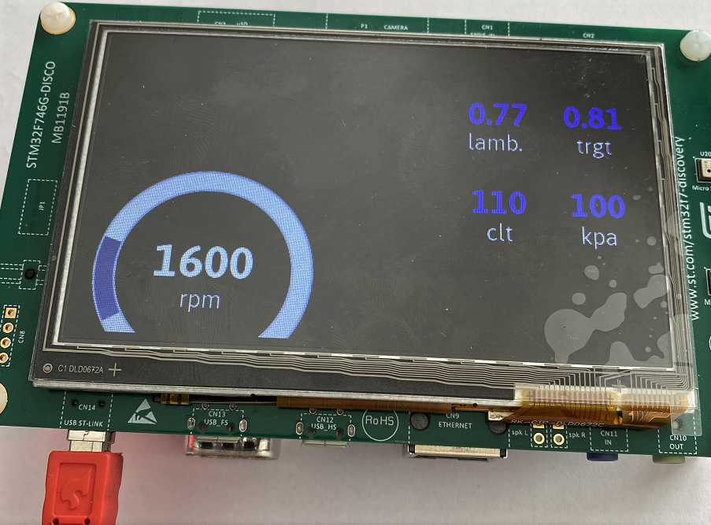
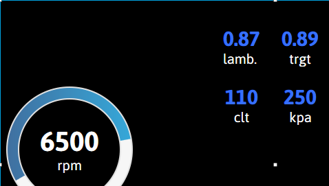
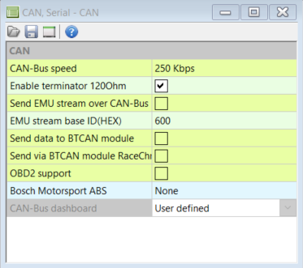
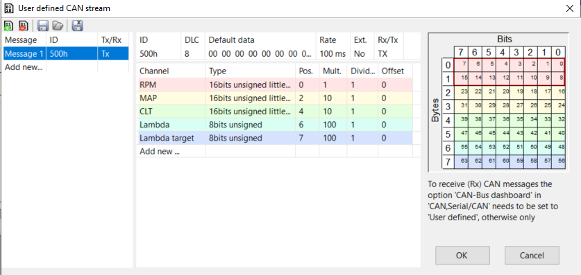

# Ecumaster black race dash

How it looks.

How it looks in TouchGFX.

This project is built on the stm32f746g-discovery board.
It was intended to be an diy solution to a race dash.

IDE used: STM32CubeIDE 1.3.0.
Gfx tool: TouchGFX 4.13.0 Designer.

## Getting started developing
1. Clone project.
2. Install STM32CubeIDE 1.3.0 and TouchGFX 4.13.0.
3. Open EcumasterBlackCanWithTouchGFX.IOC.
4. Click Additional Software.
5. Make sure STMicroelectronics.X-CUBE-TOUCHGFX 4.13.0 is installed and Application is set to TouchGFX generator.

## Good to know when coding
- Project uses C and C++.
- To work on GFX open: `project root/TouchGFX/EcumasterBlackCanWithTouchGFX.touchgfx` with TouchGFX.
- Text resources in TouchGFX are set up as wildcard buffers.
- Mapping of data to screen buffers are done in `MainView::updateVal(uint8_t* newValue)` which you find in  : `project explorer/TouchGFX/gui/src/main_screen/MainView.cpp`. If you are planning on extending the struct you need to do a search. Data is sent from main through a FreeRTOS queue. And handled in TouchGFX part of the code. 
- Canbus input data is handled in `project root/Core/Src/main.c` in function `void HAL_CAN_RxFifo0MsgPendingCallback(CAN_HandleTypeDef *hcan)`.
- Do not be afraid to experiment. Have fun!

## Ecumaster emu black settings
Bellow images is the can settings used to in ecumaster to work with the display.   
   

